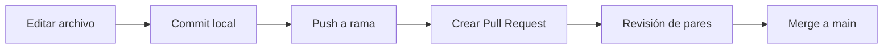

# Ejemplo avanzado de documento Markdown

> Documento de muestra para practicar colaboración, revisión y control de cambios.

## 1. Contexto

Este archivo simula una especificación breve para un mini-proyecto interno de documentación técnica.

## 2. Objetivo

Publicar una guía clara, versionada y fácil de revisar por Pull Request.

## 3. Alcance

Incluye:
- estructura de contenidos
- tabla comparativa
- checklist de calidad
- bloque de código

Excluye:
- implementación de backend
- despliegue en producción

## 4. Estructura sugerida

1. Portada y resumen
2. Requisitos
3. Flujo de trabajo
4. Criterios de aceptación
5. Historial de cambios

## 5. Tabla comparativa

| Opción | Facilidad | Control de cambios | Recomendado para equipo |
|---|---|---|---|
| Google Docs | Alta | Bajo | No |
| Notion | Alta | Medio | Depende |
| GitHub + Markdown | Media | Alto | Sí |

## 6. Flujo de colaboración (propuesto)



## 7. Snippet de ejemplo

```bash
git checkout -b docs/actualiza-guia
git add EJEMPLO_REBUSCADO.md
git commit -m "docs: agrega ejemplo avanzado de markdown"
git push -u origin docs/actualiza-guia
```

## 8. Criterios de aceptación

- [x] El documento tiene encabezados claros.
- [x] Incluye al menos una tabla.
- [x] Incluye al menos un bloque de código.
- [x] Está listo para revisión por PR.

## 9. Riesgos y mitigaciones

**Riesgo:** cambios simultáneos en el mismo párrafo.  
**Mitigación:** dividir por secciones y usar ramas por tarea.

## 10. Historial

| Fecha | Autor | Cambio |
|---|---|---|
| 2026-04-09 | mau | Creación inicial del ejemplo |

